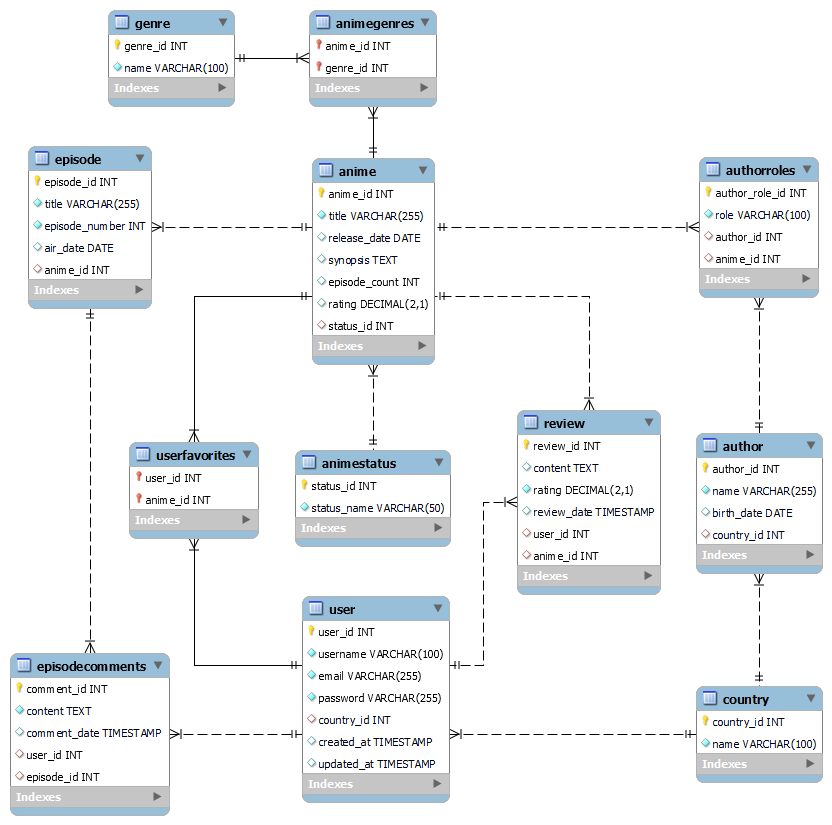

# Primera Entrega del Proyecto Final

## Anime Management System

- Autor: Tomás Echeveste Arteaga
- Curso: SQL
- Comisión: 57175
- Fecha: 19/05/24

## Objetivo

El "Anime Management System" es una base de datos diseñada para gestionar información sobre animes, estudios de animación, autores, géneros, usuarios y reseñas. Este sistema permite a los usuarios registrar animes, revisar episodios, dar sus reseñas y comentar sobre episodios específicos.

## Diagrama de Entidad-Relación (DER)

## Tablas 12

### 1. Anime

Esta tabla almacena información sobre los animes, incluyendo detalles como el título, la fecha de lanzamiento, una sinopsis, el número de episodios, el estado actual del anime y la calificación promedio. Es fundamental para gestionar y catalogar los diferentes animes disponibles en el sistema.

Contiene los siguientes campos:

- anime_id (INT, PRIMARY KEY, AUTO_INCREMENT): Identificador único del anime.
- anime_title (VARCHAR(255), NOT NULL): Título del anime.
- anime_release_date (DATE): Fecha de lanzamiento del anime.
- anime_synopsis (TEXT): Una breve descripción del anime.
- anime_episode_count (INT, CHECK (episode_count >= 0)): Número de episodios del anime, no puede ser negativo.
- anime_status_id (INT, FOREIGN KEY REFERENCES AnimeStatus(status_id)): Identificador del estado actual del anime.
- anime_rating (DECIMAL(2, 1), CHECK (rating IS NULL OR (rating >= 1 AND rating <= 10))): Calificación promedio del anime, con un decimal y en un rango de 1 a 10, puede ser nulo para animes que aún no tienen calificación. Nota, La idea es que la tabla Review almacene las calificaciones individuales de los usuarios para cada anime, y el campo rating en esta tabla almacene la calificación promedio calculada a partir de estas reseñas. Esto puede requerir un trigger u otras cosas a pensar a futuro.

Índices:

- idx_anime_title en el campo anime_title: Mejora el rendimiento de las búsquedas por título.
- idx_anime_rating en el campo anime_rating: Mejora el rendimiento de las consultas que ordenan o filtran por calificación, incluso si algunos valores son NULL.

### 2. AnimeGenres

Esta tabla almacena la relación muchos a muchos entre animes y géneros, permitiendo que un anime pertenezca a múltiples géneros y un género tenga múltiples animes. Es crucial para la categorización y búsqueda eficiente de animes según sus géneros.

Contiene los siguientes campos:

- anime_id (INT, FOREIGN KEY): Identificador del anime, referenciando a la tabla Anime.
- genre_id (INT, FOREIGN KEY): Identificador del género, referenciando a la tabla Genre.

Clave Primaria:

- La clave primaria está compuesta por anime_id y genre_id, asegurando la unicidad de cada combinación de anime y género.

Índices:

- idx_animegenres_anime en el campo anime_id: Mejora el rendimiento de las consultas para buscar géneros de un anime específico.
- idx_animegenres_genre en el campo genre_id: Mejora el rendimiento de las consultas para buscar animes de un género específico.

### 3. AnimeStatus

Esta tabla almacena los diferentes estados en los que puede estar un anime, proporcionando flexibilidad para manejar y actualizar los estados sin modificar la estructura de la tabla principal.

Contiene los siguientes campos:

- status_id (INT, PRIMARY KEY, AUTO_INCREMENT): Identificador único del estado.
- status_name (VARCHAR(50), NOT NULL, UNIQUE): Nombre del estado. Algunos valores iniciales para usar aquí serian: “Airing”, “Completed”, “Upcoming” y “On Hold”.

### 4. Author

Esta tabla almacena información sobre los autores relacionados con los animes, incluyendo su nombre, fecha de nacimiento y país de origen. Es importante para asociar los animes con sus creadores y proporcionar información biográfica relevante.

Contiene los siguientes campos:

- author_id (INT, PRIMARY KEY, AUTO_INCREMENT): Identificador único del autor.
- author_name (VARCHAR(255), NOT NULL): Nombre del autor.
- author_birth_date (DATE): Fecha de nacimiento del autor.
- author_country_id (INT, FOREIGN KEY REFERENCES Country(country_id) ON DELETE SET NULL): Referencia al país de residencia del autor.

Índices:

- idx_author_name en el campo author_name: Mejora el rendimiento de las consultas por nombre de autor.

### 5. AuthorRoles

Esta tabla almacena los roles específicos que los autores desempeñan en los animes, permitiendo una relación detallada entre autores y sus contribuciones específicas a los animes.

Contiene los siguientes campos:

- author_role_id (INT, PRIMARY KEY, AUTO_INCREMENT): Identificador único del rol del autor.
- author_role_name (VARCHAR(100), NOT NULL): Descripción del rol del autor en el anime.
- author_id (INT, FOREIGN KEY): Identificador del autor.
- anime_id (INT, FOREIGN KEY): Identificador del anime.

Índices:

- idx_author_role en el campo author_role_name: Índice para mejorar el rendimiento de las consultas por rol.

### 6. Country

Esta tabla almacena información sobre los países. Es utilizada para normalizar y referenciar países en otras tablas, mejorando la integridad y consistencia de los datos.

Contiene los siguientes campos:

- country_id (INT, PRIMARY KEY, AUTO_INCREMENT): Identificador único del país.
- country_name (VARCHAR(100), NOT NULL, UNIQUE): Nombre del país.

Índices:

- idx_country_name en el campo country_name: Mejora el rendimiento de las consultas por nombre de país.

### 7. Episode

Esta tabla almacena información sobre los episodios de los animes, incluyendo el título, número de episodio, fecha de emisión y el anime al que pertenecen.

Contiene los siguientes campos:

- episode_id (INT, PRIMARY KEY, AUTO_INCREMENT): Identificador único del episodio.
- episode_title (VARCHAR(255), NOT NULL): Título del episodio.
- episode_number (INT, NOT NULL, CHECK (episode_number >= 0)): Número del episodio en la serie.
- episode_air_date (DATE): Fecha de emisión del episodio. Nota, luego se debería agregar un trigger que verifique que esta fecha no sea anterior a la fecha de emisión del anime.
- anime_id (INT, FOREIGN KEY REFERENCES Anime(anime_id) ON DELETE CASCADE): Identificador del anime al que pertenece el episodio.

### 8. EpisodeComments

Esta tabla almacena los comentarios de los usuarios sobre los episodios de los animes, permitiendo la interacción y discusión sobre episodios específicos.

Contiene los siguientes campos:

- comment_id (INT, PRIMARY KEY, AUTO_INCREMENT): Identificador único del comentario.
- comment_content (TEXT, NOT NULL): Contenido del comentario.
- comment_date (TIMESTAMP, DEFAULT CURRENT_TIMESTAMP): Fecha en la que se hizo el comentario.
- user_id (INT, FOREIGN KEY REFERENCES User(user_id) ON DELETE CASCADE): Identificador del usuario que escribió el comentario.
- episode_id (INT, FOREIGN KEY REFERENCES Episode(episode_id) ON DELETE CASCADE): Identificador del episodio comentado.

Índices:

- idx\_ comment_user en user_id: Mejora el rendimiento de las consultas que buscan comentarios por usuario.
- idx_comment_episode en episode_id: Mejora el rendimiento de las consultas que buscan comentarios por episodio.

### 9. Genre

Esta tabla almacena información sobre los diferentes géneros de anime, permitiendo categorizar y filtrar animes según sus características temáticas. Es fundamental para gestionar la clasificación de los animes en el sistema.

Contiene los siguientes campos:

- genre_id (INT, PRIMARY KEY, AUTO_INCREMENT): Identificador único del género.
- genre_name (VARCHAR(100), NOT NULL, UNIQUE): Nombre del género. Debe ser único y no nulo para evitar duplicados y asegurar la integridad de los datos.

Índices:

- idx_genre_name en el campo genre_name: Mejora el rendimiento de las búsquedas por nombre de género.

### 10. Review

Esta tabla almacena las reseñas que los usuarios escriben sobre los animes, incluyendo el contenido de la reseña, la calificación, el usuario que la escribió y el anime reseñado.

Contiene los siguientes campos:

- review_id (INT, PRIMARY KEY, AUTO_INCREMENT): Identificador único de la reseña.
- review_content (TEXT): Contenido de la reseña. Puede ser NULL.
- review_rating (DECIMAL(2, 1) NOT NULL CHECK (rating >= 1 AND rating <= 10)): Calificación dada por el usuario, debe estar entre 1 y 10 con un decimal.
- review_date (TIMESTAMP, DEFAULT CURRENT_TIMESTAMP): Fecha en la que se hizo la reseña.
- user_id (INT, FOREIGN KEY REFERENCES User(user_id) ON DELETE CASCADE): Identificador del usuario que escribió la reseña.
- anime_id (INT, FOREIGN KEY REFERENCES Anime(anime_id) ON DELETE CASCADE): Identificador del anime sobre el que se escribió la reseña.

Índices:

- idx_review_user en user_id: Mejora el rendimiento de las consultas que buscan reseñas por usuario.
- idx_review_anime en anime_id: Mejora el rendimiento de las consultas que buscan reseñas por anime.

### 11. User

Esta tabla almacena información sobre los usuarios del sistema, incluyendo su nombre de usuario, correo electrónico y contraseña. También almacena datos adicionales como el país de residencia y las marcas de tiempo de creación y actualización. Es fundamental para gestionar el acceso y las interacciones de los usuarios con el sistema, como la creación de reseñas, la marcación de animes como favoritos y otras actividades personalizadas.

Contiene los siguientes campos:

- user_id (INT, PRIMARY KEY, AUTO_INCREMENT): Identificador único del usuario.
- user_name (VARCHAR(100), NOT NULL): Nombre de usuario.
- user_email (VARCHAR(255), NOT NULL, UNIQUE): Correo electrónico del usuario.
- user_password (VARCHAR(255), NOT NULL): Contraseña del usuario.
- country_id (INT, FOREIGN KEY REFERENCES Country(country_id) ON DELETE SET NULL): Referencia al país de residencia del usuario.
- user_created (TIMESTAMP DEFAULT CURRENT_TIMESTAMP): Marca de tiempo de creación del registro.
- user_updated (TIMESTAMP DEFAULT CURRENT_TIMESTAMP ON UPDATE CURRENT_TIMESTAMP): Marca de tiempo de la última actualización del registro.

Índices:

- idx_user_name en el campo user_name: Mejora el rendimiento de las consultas para buscar usuarios por nombre de usuario.
- idx_user_email en el campo user_email: Mejora el rendimiento de las consultas para buscar usuarios por correo electrónico y garantiza la unicidad del correo electrónico.

### 12. UserFavorites

Esta tabla almacena los animes favoritos de los usuarios, permitiendo a los usuarios marcar y acceder fácilmente a sus animes preferidos.

Contiene los siguientes campos:

- user_id (INT, FOREIGN KEY): Identificador del usuario.
- anime_id (INT, FOREIGN KEY): Identificador del anime marcado como favorito por el usuario.

Clave Primaria: La clave primaria está compuesta por anime_id y user_id.
