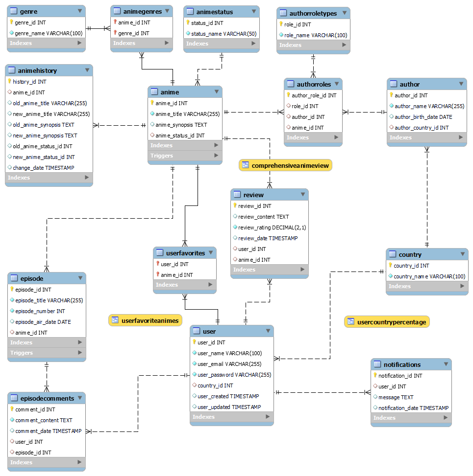
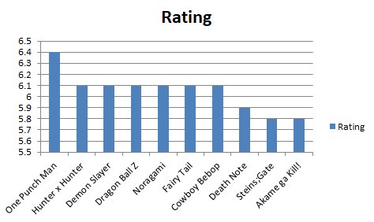
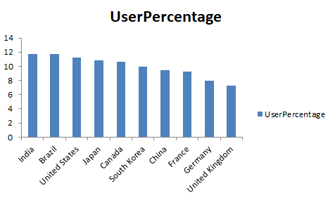

# Entrega del Proyecto Final

## Table of Contents

- [Anime Management System](#anime-management-system)
- [Objetivo](#objetivo)
- [Diagrama de Entidad-Relación (DER)](#diagrama-de-entidad-relación-der)
- [Tablas 15](#tablas-15)
  - [1. Anime](#1-anime)
  - [2. AnimeGenres](#2-animegenres)
  - [3. AnimeHistory](#3-animehistory)
  - [4. AnimeStatus](#4-animestatus)
  - [5. Author](#5-author)
  - [6. AuthorRoles](#6-authroles)
  - [7. AuthorRoleTypes](#7-authrolestypes)
  - [8. Country](#8-country)
  - [9. Episode](#9-episode)
  - [10. EpisodeComments](#10-episodereviews)
  - [11. Genre](#11-genre)
  - [12. Notifications](#12-notifications)
  - [13. Review](#13-reviews)
  - [14. User](#14-users)
  - [15. UserFavorites](#15-userfavorites)
- [Funciones 5](#funciones-5)
  - [1. GetAverageRating](#1-getaveragerating)
  - [2. GetCountryWithMostUsers](#2-getcountrywithmostusers)
  - [3. GetFavoriteAnimes](#3-getfavoriteanimes)
  - [4. GetNumberOfEpisodes](#4-getnumberofepisodes)
  - [5. GetRecentComments](#5-getrecentcomments)
- [Stored Procedures 2](#stored-procedures-2)
  - [1. AddAuthorToAnime](#1-addauthortoanime)
  - [2. AssignGenreToAnime](#2-assigngenretoanime)
- [Triggers 3](#triggers-3)
  - [1. animeChangeHistory](#1-animechangehistory)
  - [2. episodeDateConsistencyInsert](#2-episodedateconsistencyinsert-y-episodedateconsistencyupdate)
  - [3. notifyNewEpisode](#3-notifynewepisode)
- [Vistas 3](#vistas-3)
  - [1. ComprehensiveAnimeView](#1-comprehensiveanimeview)
  - [2. UserCountryPercentage](#2-usercountrypercentage)
  - [3. UserFavoriteAnimes](#3-userfavoriteanimes)
- [Análisis de Datos](#análisis-de-datos)

## Anime Management System

- Autor: Tomás Echeveste Arteaga
- Curso: SQL
- Comisión: 57175
- Fecha: 17/06/24

## Objetivo

El "Anime Management System" es una base de datos diseñada para gestionar información sobre animes, estudios de animación, autores, géneros, usuarios y reseñas. Este sistema permite a los usuarios registrar animes, revisar episodios, dar sus reseñas y comentar sobre episodios específicos.

## Diagrama de Entidad-Relación (DER)

## Tablas 15

### 1. Anime

Esta tabla almacena información sobre los animes, incluyendo detalles como el título, una sinopsis y el estado actual del anime. Es fundamental para gestionar y catalogar los diferentes animes disponibles en el sistema.

Contiene los siguientes campos:

- **anime_id** (INT, PRIMARY KEY, AUTO_INCREMENT): Identificador único del anime.
- **anime_title** (VARCHAR(255), NOT NULL, UNIQUE): Título del anime.
- **anime_synopsis** (TEXT): Una breve descripción del anime.
- **anime_status_id** (INT, FOREIGN KEY REFERENCES AnimeStatus(status_id)): Identificador del estado actual del anime.

Índices:

- **idx_anime_title** en el campo anime_title: Mejora el rendimiento de las búsquedas por título.

### 2. AnimeGenres

Esta tabla almacena la relación entre animes y géneros, indicando a qué géneros pertenece cada anime. Es fundamental para gestionar y catalogar los géneros asociados a cada anime en el sistema.

Contiene los siguientes campos:

- **anime_id** (INT, FOREIGN KEY): Identificador del anime, referenciando a la tabla Anime.
- **genre_id** (INT, FOREIGN KEY): Identificador del género, referenciando a la tabla Genre.

Clave Primaria:

- La clave primaria está compuesta por anime_id y genre_id, asegurando la unicidad de cada combinación de anime y género.

### 3. AnimeHistory

Esta tabla almacena un historial de cambios realizados en la información de los animes. Es útil para auditar y rastrear modificaciones en los datos de los animes, como actualizaciones de título, sinopsis y estado.

Contiene los siguientes campos:

- **history_id** (INT, PRIMARY KEY, AUTO_INCREMENT): Identificador único del registro de historial.
- **anime_id** (INT, FOREIGN KEY REFERENCES Anime(anime_id)): Identificador del anime que ha sido modificado.
- **old_anime_title** (VARCHAR(255)): Título antiguo del anime antes de la modificación.
- **new_anime_title** (VARCHAR(255)): Nuevo título del anime después de la modificación.
- **old_anime_synopsis** (TEXT): Sinopsis antigua del anime antes de la modificación.
- **new_anime_synopsis** (TEXT): Nueva sinopsis del anime después de la modificación.
- **old_anime_status_id** (INT): Identificador del estado antiguo del anime antes de la modificación.
- **new_anime_status_id** (INT): Identificador del nuevo estado del anime después de la modificación.
- **change_date** (TIMESTAMP, DEFAULT CURRENT_TIMESTAMP): Fecha y hora en que se realizó el cambio.

### 4. AnimeStatus

Esta tabla almacena los diferentes estados en los que puede estar un anime, proporcionando flexibilidad para manejar y actualizar los estados sin modificar la estructura de la tabla principal.

Contiene los siguientes campos:

- **status_id** (INT, PRIMARY KEY, AUTO_INCREMENT): Identificador único del estado.
- **status_name** (VARCHAR(50), NOT NULL, UNIQUE): Nombre del estado.

### 5. Author

Esta tabla almacena información sobre los autores relacionados con los animes, incluyendo su nombre, fecha de nacimiento y país de origen. Es importante para asociar los animes con sus creadores y proporcionar información biográfica relevante.

Contiene los siguientes campos:

- **author_id** (INT, PRIMARY KEY, AUTO_INCREMENT): Identificador único del autor.
- **author_name** (VARCHAR(255), NOT NULL, UNIQUE): Nombre del autor.
- **author_birth_date** (DATE): Fecha de nacimiento del autor.
- **author_country_id** (INT, FOREIGN KEY REFERENCES Country(country_id) ON DELETE SET NULL): Referencia al país de residencia del autor.

Índices:

- **idx_author_name** en el campo author_name: Mejora el rendimiento de las consultas por nombre de autor.

### 6. AuthorRoles

Esta tabla almacena los roles específicos que los autores desempeñan en los animes, permitiendo una relación detallada entre autores y sus contribuciones específicas a los animes.

Contiene los siguientes campos:

- **author_role_id** (INT, PRIMARY KEY, AUTO_INCREMENT): Identificador único del rol del autor.
- **role_id** (INT, FOREIGN KEY REFERENCES AuthorRoleTypes(role_id) ON DELETE CASCADE): Identificador del tipo de rol que desempeña el autor.
- **author_id** (INT, FOREIGN KEY REFERENCES Author(author_id) ON DELETE CASCADE): Identificador del autor.
- **anime_id** (INT, FOREIGN KEY REFERENCES Anime(anime_id) ON DELETE CASCADE): Identificador del anime.

### 7. AuthorRoleTypes

Esta tabla almacena los diferentes tipos de roles que los autores pueden desempeñar en los animes, como escritor, director, productor, etc. Es fundamental para categorizar y definir claramente las contribuciones de cada autor a un anime.

Contiene los siguientes campos:

- **role_id** (INT, PRIMARY KEY, AUTO_INCREMENT): Identificador único del tipo de rol.
- **role_name** (VARCHAR(100), NOT NULL, UNIQUE): Nombre del rol, debe ser único.

Índices:

- **idx_role_name** en el campo role_name: Mejora el rendimiento de las búsquedas por nombre de rol.

### 8. Country

Esta tabla almacena información sobre los países. Es utilizada para normalizar y referenciar países en otras tablas, mejorando la integridad y consistencia de los datos.

Contiene los siguientes campos:

- **country_id** (INT, PRIMARY KEY, AUTO_INCREMENT): Identificador único del país.
- **country_name** (VARCHAR(100), NOT NULL, UNIQUE): Nombre del país.

Índices:

- **idx_country_name** en el campo country_name: Mejora el rendimiento de las consultas por nombre de país.

### 9. Episode

Esta tabla almacena información sobre los episodios de los animes, incluyendo el título, número de episodio, fecha de emisión y el anime al que pertenecen.

Contiene los siguientes campos:

- **episode_id** (INT, PRIMARY KEY, AUTO_INCREMENT): Identificador único del episodio.
- **episode_title** (VARCHAR(255), NOT NULL, UNIQUE): Título del episodio.
- **episode_number** (INT, NOT NULL, CHECK (episode_number >= 0)): Número del episodio en la serie.
- **episode_air_date** (DATE): Fecha de emisión del episodio.
- **anime_id** (INT, FOREIGN KEY REFERENCES Anime(anime_id) ON DELETE CASCADE): Identificador del anime al que pertenece el episodio.

Restricciones adicionales:

**UNIQUE** (**anime_id**, **episode_number**): Asegura que no haya duplicación de episodios dentro de un mismo anime, permitiendo que cada combinación de anime_id y episode_number sea única.

### 10. EpisodeComments

Esta tabla almacena los comentarios de los usuarios sobre los episodios de los animes, permitiendo la interacción y discusión sobre episodios específicos.

Contiene los siguientes campos:

- **comment_id** (INT, PRIMARY KEY, AUTO_INCREMENT): Identificador único del comentario.
- **comment_content** (TEXT, NOT NULL): Contenido del comentario.
- **comment_date** (TIMESTAMP, DEFAULT CURRENT_TIMESTAMP): Fecha en la que se hizo el comentario.
- **user_id** (INT, FOREIGN KEY REFERENCES User(user_id) ON DELETE CASCADE): Identificador del usuario que escribió el comentario.
- **episode_id** (INT, FOREIGN KEY REFERENCES Episode(episode_id) ON DELETE CASCADE): Identificador del episodio comentado.

### 11. Genre

Esta tabla almacena información sobre los diferentes géneros de anime, permitiendo categorizar y filtrar animes según sus características temáticas. Es fundamental para gestionar la clasificación de los animes en el sistema.

Contiene los siguientes campos:

- **genre_id** (INT, PRIMARY KEY, AUTO_INCREMENT): Identificador único del género.
- **genre_name** (VARCHAR(100), NOT NULL, UNIQUE): Nombre del género. Debe ser único y no nulo para evitar duplicados y asegurar la integridad de los datos.

Índices:

- **idx_genre_name** en el campo genre_name: Mejora el rendimiento de las búsquedas por nombre de género.

### 12. Notifications

Esta tabla almacena notificaciones enviadas a los usuarios. Es útil para informar a los usuarios sobre eventos relevantes, como la publicación de nuevos episodios de sus animes favoritos.

Contiene los siguientes campos:

- **notification_id** (INT, PRIMARY KEY, AUTO_INCREMENT): Identificador único de la notificación.
- **user_id** (INT, FOREIGN KEY REFERENCES User(user_id)): Identificador del usuario al que se le envía la notificación.
- **message** (TEXT): Mensaje de la notificación.
- **notification_date** (TIMESTAMP, DEFAULT CURRENT_TIMESTAMP): Fecha y hora en que se creó la notificación.

### 13. Review

Esta tabla almacena las reseñas que los usuarios escriben sobre los animes, incluyendo el contenido de la reseña, la calificación, el usuario que la escribió y el anime reseñado.

Contiene los siguientes campos:

- **review_id** (INT, PRIMARY KEY, AUTO_INCREMENT): Identificador único de la reseña.
- **review_content** (TEXT): Contenido de la reseña. Puede ser NULL.
- **review_rating** (DECIMAL(2, 1) NOT NULL CHECK (rating >= 1 AND rating <= 10)): Calificación dada por el usuario, debe estar entre 1 y 10 con un decimal.
- **review_date** (TIMESTAMP, DEFAULT CURRENT_TIMESTAMP): Fecha en la que se hizo la reseña.
- **user_id** (INT, FOREIGN KEY REFERENCES User(user_id) ON DELETE CASCADE): Identificador del usuario que escribió la reseña.
- **anime_id** (INT, FOREIGN KEY REFERENCES Anime(anime_id) ON DELETE CASCADE): Identificador del anime sobre el que se escribió la reseña.

Índices:

- **idx_review_rating** en el campo review_rating: Mejora el rendimiento de las consultas que filtran o agrupan por calificación.
- **idx_review_date** en el campo review_date: Mejora el rendimiento de las consultas que buscan reseñas por fecha.

### 14. User

Esta tabla almacena información sobre los usuarios del sistema, incluyendo su nombre de usuario, correo electrónico y contraseña. También almacena datos adicionales como el país de residencia y las marcas de tiempo de creación y actualización. Es fundamental para gestionar el acceso y las interacciones de los usuarios con el sistema, como la creación de reseñas, la marcación de animes como favoritos y otras actividades personalizadas.

Contiene los siguientes campos:

- **user_id** (INT, PRIMARY KEY, AUTO_INCREMENT): Identificador único del usuario.
- **user_name** (VARCHAR(100), NOT NULL, UNIQUE): Nombre de usuario.
- **user_email** (VARCHAR(255), NOT NULL, UNIQUE): Correo electrónico del usuario.
- **user_password** (VARCHAR(255), NOT NULL): Contraseña del usuario.
- **country_id** (INT, FOREIGN KEY REFERENCES Country(country_id) ON DELETE SET NULL): Referencia al país de residencia del usuario.
- **user_created** (TIMESTAMP DEFAULT CURRENT_TIMESTAMP): Marca de tiempo de creación del registro.
- **user_updated** (TIMESTAMP DEFAULT CURRENT_TIMESTAMP ON UPDATE CURRENT_TIMESTAMP): Marca de tiempo de la última actualización del registro.

Índices:

- **idx_user_name** en el campo user_name: Mejora el rendimiento de las consultas para buscar usuarios por nombre de usuario.
- **idx_user_email** en el campo user_email: Mejora el rendimiento de las consultas para buscar usuarios por correo electrónico y garantiza la unicidad del correo electrónico.

### 15. UserFavorites

Esta tabla almacena los animes favoritos de los usuarios, permitiendo a los usuarios marcar y acceder fácilmente a sus animes preferidos.

Contiene los siguientes campos:

- **user_id** (INT, FOREIGN KEY): Identificador del usuario.
- **anime_id** (INT, FOREIGN KEY): Identificador del anime marcado como favorito por el usuario.

Clave Primaria: La clave primaria está compuesta por anime_id y user_id.

## Funciones 5

### 1. GetAverageRating

Descripción: Esta función devuelve la calificación promedio de un anime específico.

Propósito: Obtener la calificación media basada en las reseñas de los usuarios para un anime en particular.

Tabla que Interviene: _Review_

Objetivo: Proveer una manera fácil de acceder a la valoración general de un anime, lo cual puede ser útil para potenciales espectadores y analistas de contenido.

### 2. GetCountryWithMostUsers

Descripción: Esta función devuelve el nombre del país con la mayor cantidad de usuarios registrados.

Propósito: Identificar el país con la mayor base de usuarios.

Tabla que Interviene: _Country_, _User_

Objetivo: Ayudar en el análisis demográfico de los usuarios, útil para estrategias de marketing y mejoras en el servicio basadas en la ubicación geográfica de la mayoría de los usuarios.

### 3. GetFavoriteAnimes

Descripción: Esta función devuelve una lista de los animes favoritos de un usuario en formato de texto, ordenada alfabéticamente por título.

Propósito: Listar los animes que un usuario ha marcado como favoritos.

Tabla que Interviene: _UserFavorites_, _Anime_

Objetivo: Proporcionar una forma conveniente para que los usuarios vean sus animes favoritos en una lista consolidada y ordenada.

### 4. GetNumberOfEpisodes

Descripción: Esta función devuelve el número de episodios de un anime específico.

Propósito: Permite conocer la cantidad de episodios disponibles para un anime determinado.

Tabla que Interviene: _Episode_

Objetivo: Facilitar la consulta rápida del número total de episodios asociados a un anime, útil para usuarios y administradores que deseen conocer la extensión de la serie.

### 5. GetRecentComments

Descripción: Esta función devuelve los comentarios más recientes de un episodio específico, limitados a un número específico de comentarios.

Propósito: Recuperar los comentarios más recientes asociados a un episodio.

Tabla que Interviene: _EpisodeComments_

Objetivo: Permitir a los usuarios ver los comentarios más actuales sobre un episodio en particular, mejorando la interacción y el análisis del feedback recibido.

## Stored Procedures 2

### 1. AddAuthorToAnime

Descripción: Este stored procedure añade un autor con un rol específico a un anime en la tabla AuthorRoles.

Propósito: Insertar un registro en la tabla AuthorRoles que relacione un autor y un rol con un anime específico.

Tablas que Intervienen: _AuthorRoles_

Objetivo: Facilitar la asignación de autores a animes con roles específicos, mejorando la gestión de los colaboradores en los proyectos de anime.

### 2. AssignGenreToAnime

Descripción: Este stored procedure asigna un género a un anime en la tabla AnimeGenres después de verificar que ambos existen.

Propósito: Asegurar que solo se asignen géneros a animes existentes, evitando errores de integridad referencial.

Tablas que Intervienen: _Anime_, _Genre_, _AnimeGenres_

Objetivo: Mantener la integridad de los datos al asignar géneros a animes, garantizando que las relaciones sean válidas y existan las referencias correspondientes.

## Triggers 3

### 1. animeChangeHistory

Descripción: Este trigger guarda un historial de los cambios realizados en la tabla Anime, como actualizaciones de título, sinopsis, estado, etc.

Tablas que Intervienen: _Anime_, _AnimeHistory_

Objetivo: Mantener un registro de las modificaciones en la información de los animes para auditoría y seguimiento de cambios.

### 2. episodeDateConsistencyInsert y episodeDateConsistencyUpdate

Descripción: Estos triggers aseguran la consistencia en las fechas de emisión de los episodios en relación con su numeración. Verifican que un episodio con un número mayor no tenga una fecha de emisión anterior a un episodio con un número menor y viceversa.

Propósito: Mantener la coherencia temporal entre los episodios de un anime.

Tablas que Intervienen: _Episode_

Objetivo: Evitar inconsistencias en las fechas de emisión de los episodios que podrían afectar la lógica del sistema y la experiencia del usuario.

### 3. notifyNewEpisode

Descripción: Este trigger inserta una notificación en una tabla de notificaciones cada vez que se publica un nuevo episodio de un anime que está en la lista de favoritos de un usuario.

Tablas que Intervienen: _Episode_, _UserFavorites_, _Notifications_

Objetivo: Notificar a los usuarios sobre la publicación de nuevos episodios de sus animes favoritos, mejorando la interacción y el compromiso de los usuarios.

## Vistas 3

### 1. ComprehensiveAnimeView

Descripción: Esta vista proporciona una visión completa de los animes, incluyendo detalles como el título, la fecha de lanzamiento, la sinopsis, el estado, los géneros, los autores con sus roles y países, el número de episodios, comentarios, favoritos y la calificación promedio.

Tablas que Intervienen: _Anime_, _Episode_, _AnimeGenres_, _Genre_, _AuthorRoles_, _Author_, _AuthorRoleTypes_, _Country_, _AnimeStatus_, _EpisodeComments_, _UserFavorites_, _Review_

Objetivo: Facilitar el acceso a una visión consolidada y detallada de la información relevante de cada anime, combinando datos de múltiples tablas en una sola vista.

### 2. UserCountryPercentage

Descripción: Esta vista calcula el porcentaje de usuarios por país, mostrando el nombre del país, el número de usuarios y el porcentaje que representan del total de usuarios.

Tablas que Intervienen: _User_, _Country_

Objetivo: Proveer una distribución porcentual de los usuarios por país, ayudando a entender la demografía de los usuarios.

### 3. UserFavoriteAnimes

Descripción: Esta vista muestra los animes favoritos de cada usuario, agrupando los títulos de los animes favoritos de cada usuario en un solo campo.

Tablas que Intervienen: _UserFavorites_, _User_, _Anime_

Objetivo: Proveer una lista consolidada de los animes favoritos de cada usuario, facilitando la consulta de esta información.

## Análisis de Datos

En esta sección se presentan dos gráficos clave que ofrecen una visión más profunda de los datos gestionados por el sistema.

### 1. Animes Más Populares

Este gráfico muestra los 10 animes más populares según las calificaciones promedio de los usuarios.

### 2. Países con Mayor Cantidad de Usuarios

Este gráfico destaca los países con la mayor cantidad de usuarios registrados en el sistema. Es útil para entender la distribución geográfica de la base de usuarios y puede ser utilizado para estrategias de marketing y expansión.

